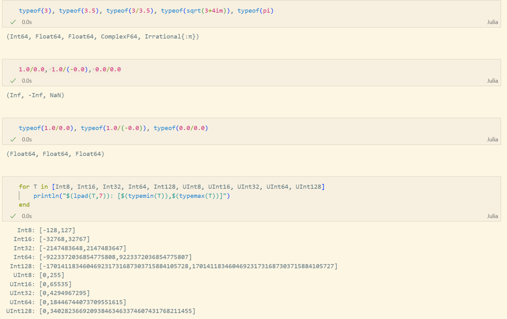
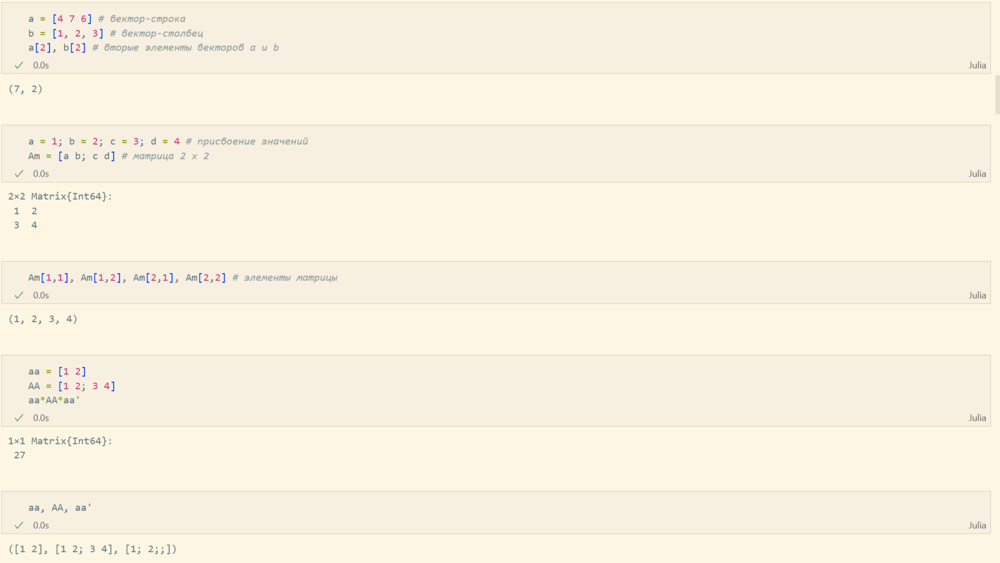
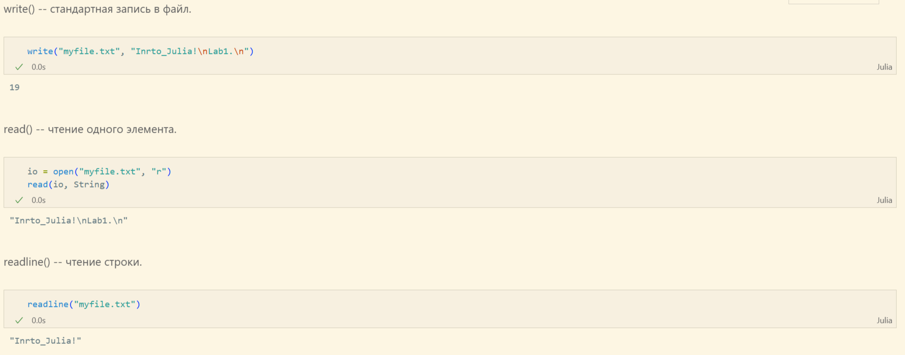
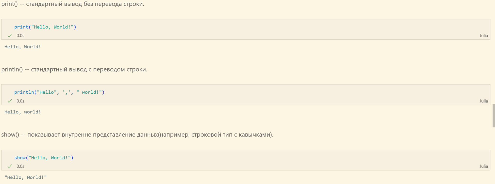
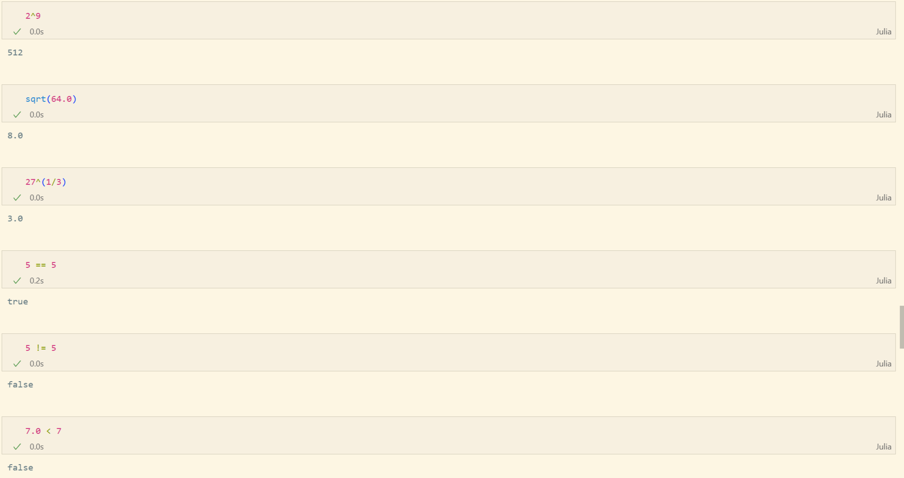
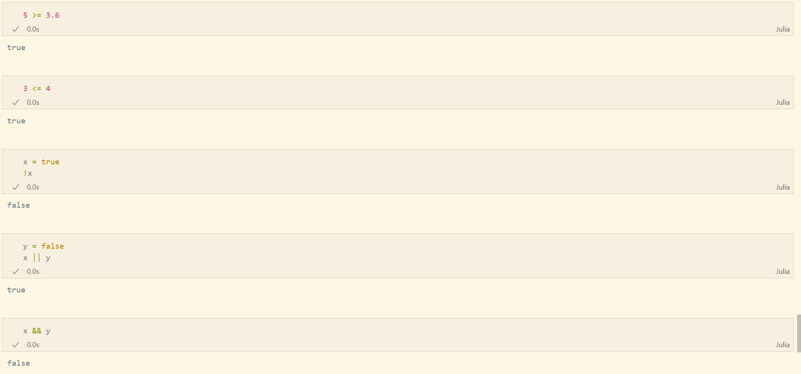
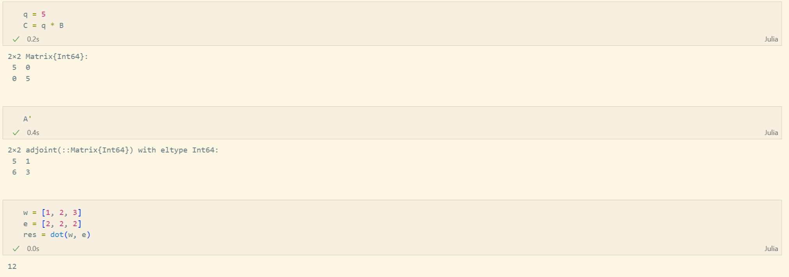

---
## Front matter
lang: ru-RU
title: Лабораторная работа №1
subtitle: "Julia. Установка и настройка. Основные принципы"
author:
  - Чемоданова Ангелина Александровна
teacher:
  - Кулябов Д. С.
  - д.ф.-м.н., профессор
  - профессор кафедры теории вероятностей и кибербезопасности 
institute:
  - Российский университет дружбы народов имени Патриса Лумумбы, Москва, Россия
date: 08 сентября 2025

## i18n babel
babel-lang: russian
babel-otherlangs: english

## Formatting pdf
toc: false
toc-title: Содержание
slide_level: 2
aspectratio: 169
section-titles: true
theme: metropolis
header-includes:
 - \metroset{progressbar=frametitle,sectionpage=progressbar,numbering=fraction}
---

## Докладчик

:::::::::::::: {.columns align=center}
::: {.column width="70%"}

  * Чемоданова Ангелина Александровна
  * Cтудентка НФИбд-02-22
  * Российский университет дружбы народов имени Патриса Лумумбы
  * [1132226443@pfur.ru](mailto:1132226443@pfur.ru)
  * <https://github.com/aachemodanova>

:::
::: {.column width="30%"}

:::
::::::::::::::

## Цели и задачи

**Цель работы**

Основная цель работы — подготовить рабочее пространство и инструментарий для работы с языком программирования Julia, на простейших примерах познакомиться с основами синтаксиса Julia.

**Задание**

1. Установите под свою операционную систему Julia, Jupyter.
2. Используя Jupyter Lab, повторите примеры.
3. Выполните задания для самостоятельной работы.

## Подготовка инструментария к работе

На моем компьютере ранее уже была установлена Julia для выполнения работ по "Математическому моделированию":

{ #fig:001 width=100% height=100% }

## Основы синтаксиса Julia на примерах

Для начала потренируемся с определением типов числовых величин:

{ #fig:002 width=70% height=70% }

## Основы синтаксиса Julia на примерах

После чего приступим к рассмотрению приведения аргументов к одному типу:

{ #fig:003 width=90% height=90% }

## Основы синтаксиса Julia на примерах

И рассмотрим примеры определения функций, а также работу с массивами:

{ #fig:004 width=80% height=80% }

## Основы синтаксиса Julia на примерах

{ #fig:005 width=80% height=80% }

## Самостоятельная работа

В первом задании рассмотрим основные функции для чтения / записи / вывода информации на экран. Для этого составим свои примеры:

{ #fig:006 width=100% height=100% }

## Самостоятельная работа

{ #fig:007 width=100% height=100% }

## Самостоятельная работа

{ #fig:008 width=100% height=100% }

## Самостоятельная работа

Во втором задании состаивим пример для функции parse():

{ #fig:009 width=100% height=100% }

## Самостоятельная работа

Далее изучим синтаксис Julia для базовых математических операций с разным типом переменных:

{ #fig:010 width=60% height=60% }

## Самостоятельная работа

{ #fig:011 width=80% height=80% }

## Самостоятельная работа

{ #fig:012 width=100% height=100% }

## Самостоятельная работа

В конце работы приведём несколько примеров с операциями над матрицами:

{ #fig:013 width=80% height=80% }

## Самостоятельная работа

{ #fig:014 width=100% height=100% }

## Выводы

В результате выполнения данной лабораторной работы мы подготовили рабочее пространство и инструментарий для работы с языком программирования Julia, на простейших примерах познакомились с основами синтаксиса Julia.
