---
## Front matter
title: "Лабораторная работа №1"
subtitle: "Julia. Установка и настройка. Основные принципы"
author: "Чемоданова Ангелина Александровна"

## Generic otions
lang: ru-RU
toc-title: "Содержание"

## Bibliography
bibliography: bib/cite.bib
csl: pandoc/csl/gost-r-7-0-5-2008-numeric.csl

## Pdf output format
toc: true # Table of contents
toc-depth: 2
lof: true # List of figures
lot: false # List of tables
fontsize: 12pt
linestretch: 1.5
papersize: a4
documentclass: scrreprt
## I18n polyglossia
polyglossia-lang:
  name: russian
  options:
	- spelling=modern
	- babelshorthands=true
polyglossia-otherlangs:
  name: english
## I18n babel
babel-lang: russian
babel-otherlangs: english
## Fonts
mainfont: IBM Plex Serif
romanfont: IBM Plex Serif
sansfont: IBM Plex Sans
monofont: IBM Plex Mono
mathfont: STIX Two Math
mainfontoptions: Ligatures=Common,Ligatures=TeX,Scale=0.94
romanfontoptions: Ligatures=Common,Ligatures=TeX,Scale=0.94
sansfontoptions: Ligatures=Common,Ligatures=TeX,Scale=MatchLowercase,Scale=0.94
monofontoptions: Scale=MatchLowercase,Scale=0.94,FakeStretch=0.9
mathfontoptions:
## Biblatex
biblatex: true
biblio-style: "gost-numeric"
biblatexoptions:
  - parentracker=true
  - backend=biber
  - hyperref=auto
  - language=auto
  - autolang=other*
  - citestyle=gost-numeric
## Pandoc-crossref LaTeX customization
figureTitle: "Рис."
tableTitle: "Таблица"
listingTitle: "Листинг"
lofTitle: "Список иллюстраций"
lotTitle: "Список таблиц"
lolTitle: "Листинги"
## Misc options
indent: true
header-includes:
  - \usepackage{indentfirst}
  - \usepackage{float} # keep figures where there are in the text
  - \floatplacement{figure}{H} # keep figures where there are in the text
---

# Введение

## Цели и задачи

**Цель работы**

Основная цель работы — подготовить рабочее пространство и инструментарий для работы с языком программирования Julia, на простейших примерах познакомиться с основами синтаксиса Julia[@julialang][@juliadoc].

**Задание**

1. Установите под свою операционную систему Julia, Jupyter.
2. Используя Jupyter Lab, повторите примеры.
3. Выполните задания для самостоятельной работы.

# Выполнение лабораторной работы

## Подготовка инструментария к работе

На моем компьютере ранее уже была установлена Julia для выполнения работ по "Математическому моделированию"(рис. [-@fig:001]):

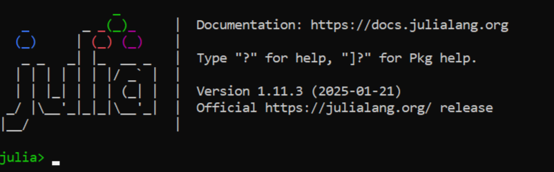{ #fig:001 width=100% height=100% }

## Основы синтаксиса Julia на примерах

Для начала потренируемся с определением типов числовых величин (рис. [-@fig:002]):

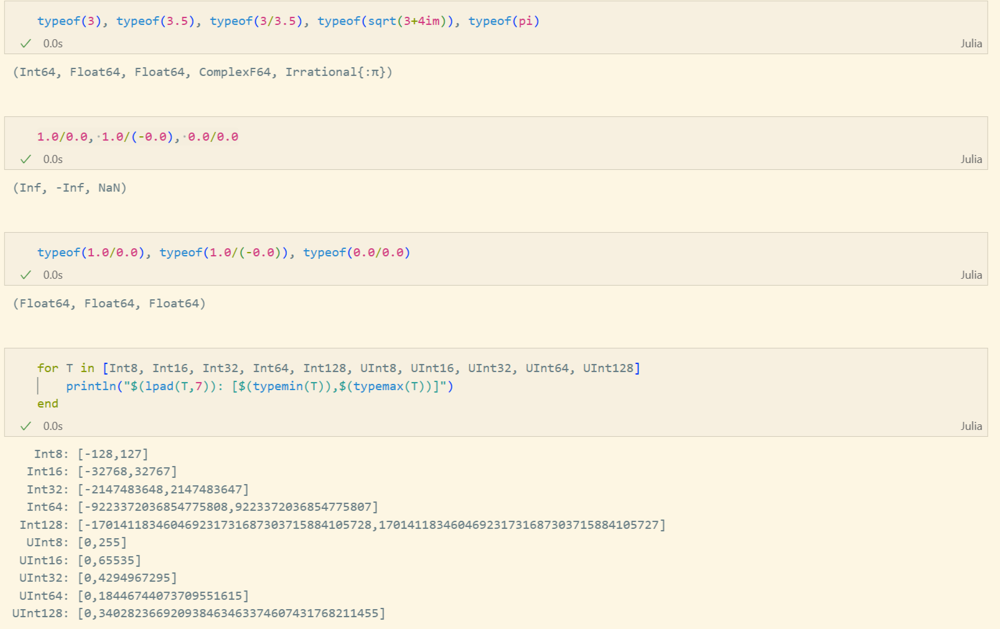{ #fig:002 width=100% height=100% }

После чего приступим к рассмотрению приведения аргументов к одному типу (рис. [-@fig:003]):

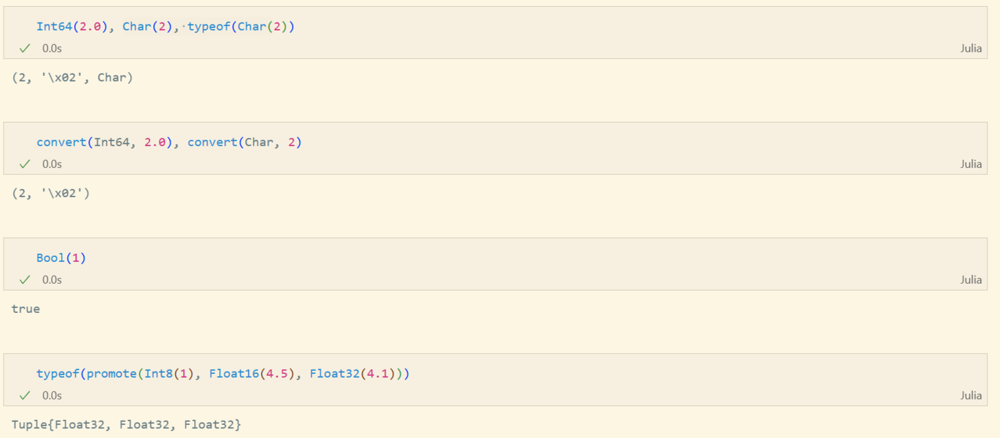{ #fig:003 width=100% height=100% }

И рассмотрим примеры определения функций (рис. [-@fig:004]), а также работу с массивами (рис. [-@fig:005]):

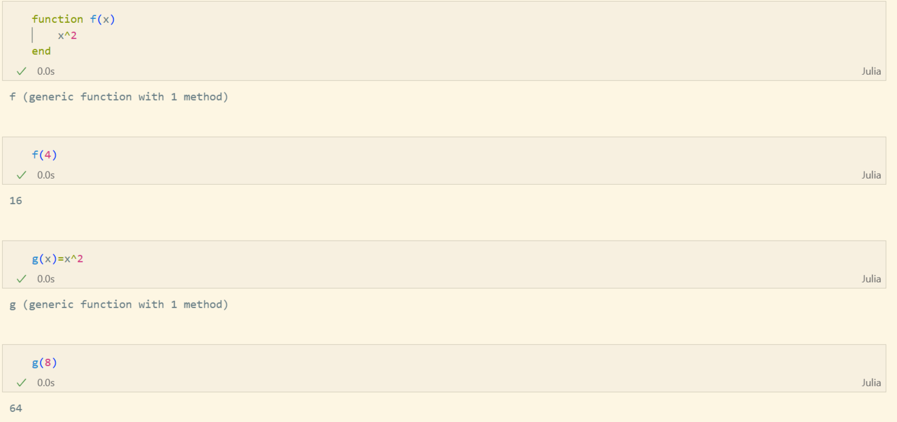{ #fig:004 width=100% height=100% }

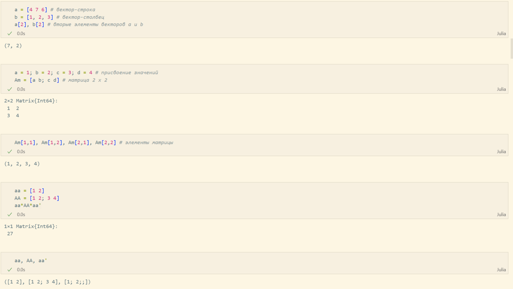{ #fig:005 width=100% height=100% }

## Самостоятельная работа

В первом задании рассмотрим основные функции для чтения / записи / вывода информации на экран. Для этого составим свои примеры (рис. [-@fig:006] - рис. [-@fig:008]):

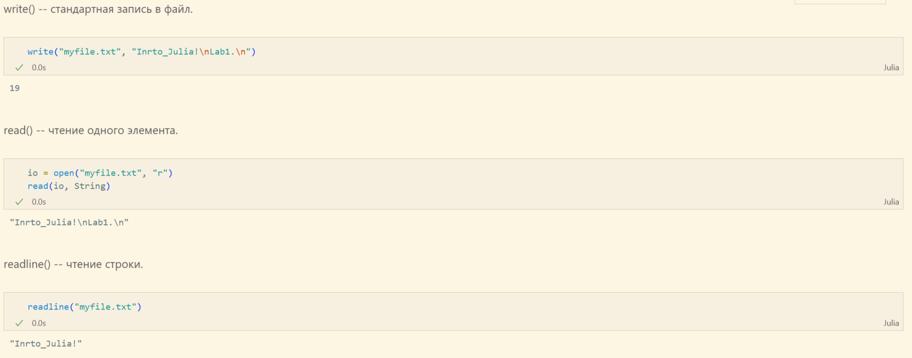{ #fig:006 width=100% height=100% }

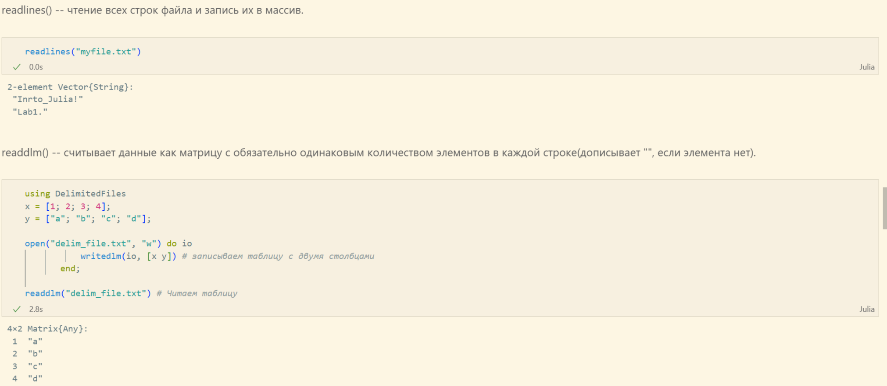{ #fig:007 width=100% height=100% }

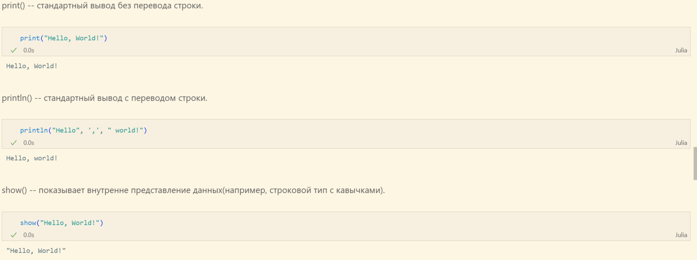{ #fig:008 width=100% height=100% }

- read() -- чтение одного элемента, 
- readline() -- чтение строки, 
- readlines() -- чтение всех строк файла и запись их в массив, 
- readdlm() -- считывает данные как матрицу с обязательно одинаковым количеством элементов в каждой строке(дописывает `""`, если элемента нет), 
- print() -- стандартный вывод без перевода строки, 
- println() -- стандартный вывод с переводом строки, 
- show() -- показывает внутренне представление данных(например, строковой тип с кавычками), 
- write() -- стандартная запись в файл.

Во втором задании состаивим пример для функции parse() (рис. [-@fig:009]):

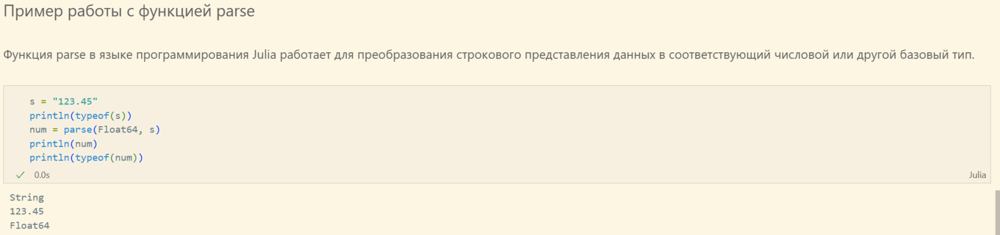{ #fig:009 width=100% height=100% }

Далее изучим синтаксис Julia для базовых математических операций с разным типом переменных (рис. [-@fig:010] - рис. [-@fig:012]):

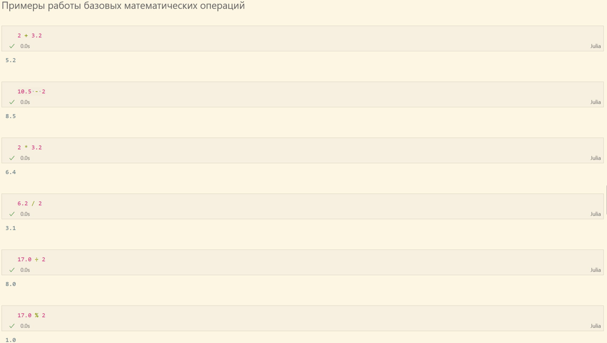{ #fig:010 width=100% height=100% }

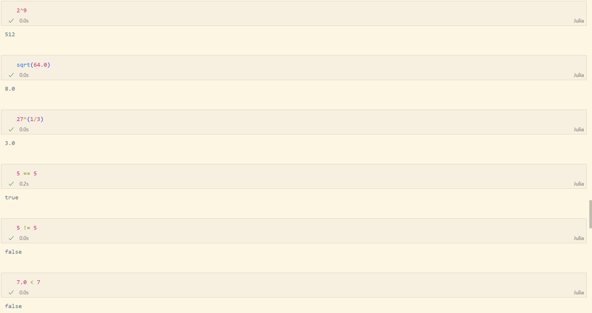{ #fig:011 width=100% height=100% }

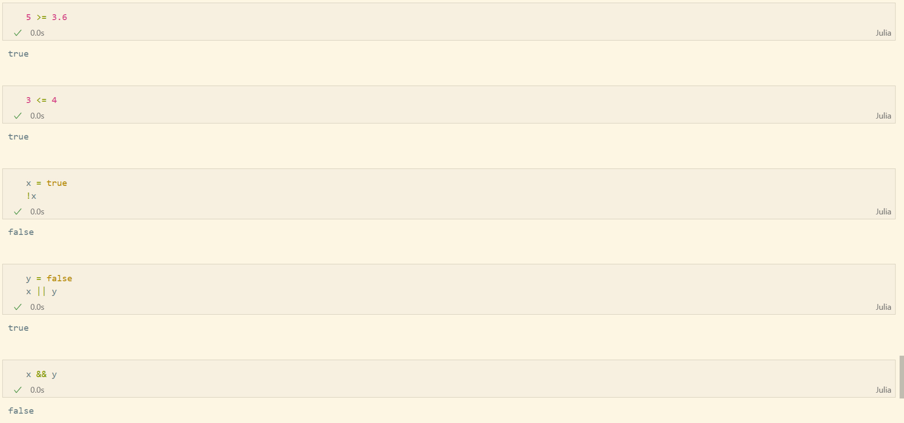{ #fig:012 width=100% height=100% }

В конце работы приведём несколько примеров с операциями над матрицами (рис. [-@fig:013] - рис. [-@fig:014]):

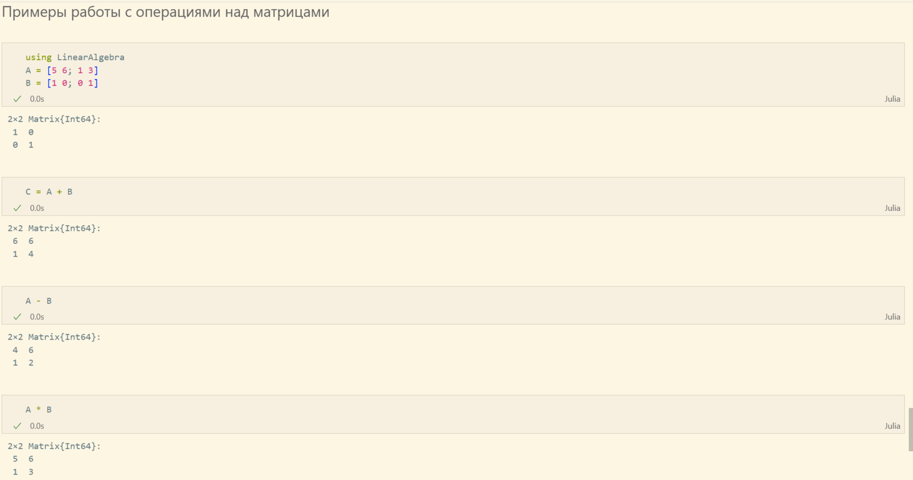{ #fig:013 width=100% height=100% }

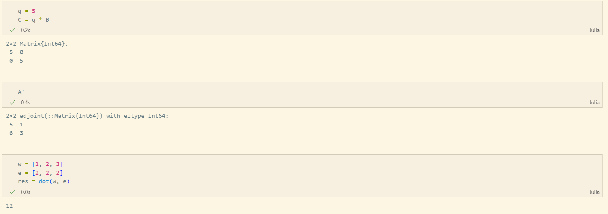{ #fig:014 width=100% height=100% }

# Выводы

В результате выполнения данной лабораторной работы мы подготовили рабочее пространство и инструментарий для работы с языком программирования Julia, на простейших примерах познакомились с основами синтаксиса Julia.

# Список литературы{.unnumbered}

::: {#refs}
:::
