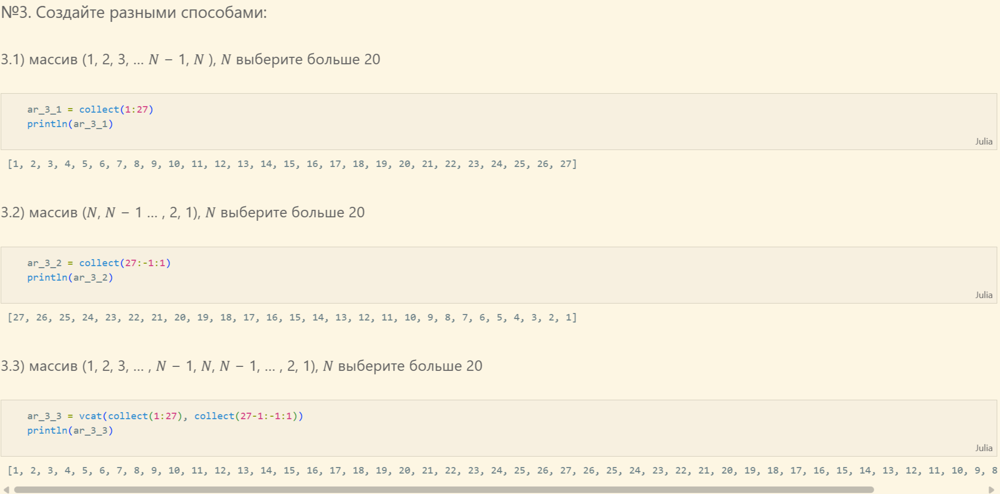

---
## Front matter
title: "Лабораторная работа №2"
subtitle: "Структуры данных"
author: "Чемоданова Ангелина Александровна"

## Generic otions
lang: ru-RU
toc-title: "Содержание"

## Bibliography
bibliography: bib/cite.bib
csl: pandoc/csl/gost-r-7-0-5-2008-numeric.csl

## Pdf output format
toc: true # Table of contents
toc-depth: 2
lof: true # List of figures
lot: false # List of tables
fontsize: 12pt
linestretch: 1.5
papersize: a4
documentclass: scrreprt
## I18n polyglossia
polyglossia-lang:
  name: russian
  options:
	- spelling=modern
	- babelshorthands=true
polyglossia-otherlangs:
  name: english
## I18n babel
babel-lang: russian
babel-otherlangs: english
## Fonts
mainfont: IBM Plex Serif
romanfont: IBM Plex Serif
sansfont: IBM Plex Sans
monofont: IBM Plex Mono
mathfont: STIX Two Math
mainfontoptions: Ligatures=Common,Ligatures=TeX,Scale=0.94
romanfontoptions: Ligatures=Common,Ligatures=TeX,Scale=0.94
sansfontoptions: Ligatures=Common,Ligatures=TeX,Scale=MatchLowercase,Scale=0.94
monofontoptions: Scale=MatchLowercase,Scale=0.94,FakeStretch=0.9
mathfontoptions:
## Biblatex
biblatex: true
biblio-style: "gost-numeric"
biblatexoptions:
  - parentracker=true
  - backend=biber
  - hyperref=auto
  - language=auto
  - autolang=other*
  - citestyle=gost-numeric
## Pandoc-crossref LaTeX customization
figureTitle: "Рис."
tableTitle: "Таблица"
listingTitle: "Листинг"
lofTitle: "Список иллюстраций"
lotTitle: "Список таблиц"
lolTitle: "Листинги"
## Misc options
indent: true
header-includes:
  - \usepackage{indentfirst}
  - \usepackage{float} # keep figures where there are in the text
  - \floatplacement{figure}{H} # keep figures where there are in the text
---

# Введение

## Цели и задачи

**Цель работы**

Основная цель работы — изучить несколько структур данных, реализованных в Julia, научиться применять их и операции над ними для решения задач[@julialang].

**Задание**

1. Используя Jupyter Lab, повторите примеры.
2. Выполните задания для самостоятельной работы[@juliadoc].

# Выполнение лабораторной работы

##  Кортежи

Кортеж (Tuple) — структура данных (контейнер) в виде неизменяемой индексируемой последовательности элементов какого-либо типа (элементы индексируются с единицы). 

Синтаксис определения кортежа: (element1, element2, ...). 

Примеры кортежей (рис. [-@fig:001]):

{ #fig:001 width=100% height=100% }

Примеры операций над кортежами (рис. [-@fig:002]):

{ #fig:002 width=100% height=100% }

##  Словари

Словарь — неупорядоченный набор связанных между собой по ключу данных. 

Синтаксис определения словаря: Dict(key1 => value1, key2 => value2, ...). 

Примеры словарей и операций над ними (рис. [-@fig:003]-рис. [-@fig:004]):

{ #fig:003 width=100% height=100% }

{ #fig:004 width=100% height=100% }

## Множества

Множество, как структура данных в Julia, соответствует множеству, как математическому объекту, то есть является неупорядоченной совокупностью элементов какого-либо типа.  Возможные операции над множествами: объединение, пересечение, разность; принадлежность элемента множеству.

Синтаксис определения множества: Set([itr]) где itr — набор значений, сгенерированных данным итерируемым объектом или пустое 
множество.

Примеры множеств и операций над ними (рис. [-@fig:005] - рис. [-@fig:007]):

{ #fig:005 width=100% height=100% }

{ #fig:006 width=100% height=100% }

{ #fig:007 width=100% height=100% }

## Массивы

Массив — коллекция упорядоченных элементов, размещённая в многомерной сетке. Векторы и матрицы являются частными случаями массивов.

Общий синтаксис одномерных массивов: array_name_1 = [element1, element2, ...], array_name_2 = [element1 element2 ...]

Примеры массивов (рис. [-@fig:008] - рис. [-@fig:010]):

{ #fig:008 width=100% height=100% }

{ #fig:009 width=100% height=100% }

{ #fig:010 width=100% height=100% }

Примеры массивов, заданных некоторыми функциями через включение (рис. [-@fig:011]):

{ #fig:011 width=100% height=100% }

Некоторые операции для работы с массивами: (рис. [-@fig:012] - рис. [-@fig:022]):

{ #fig:012 width=100% height=100% }

{ #fig:013 width=100% height=100% }

{ #fig:014 width=100% height=100% }

{ #fig:015 width=100% height=100% }

{ #fig:016 width=100% height=100% }

{ #fig:017 width=100% height=100% }

{ #fig:018 width=100% height=100% }

{ #fig:019 width=100% height=100% }

{ #fig:020 width=100% height=100% }

{ #fig:021 width=100% height=100% }

{ #fig:022 width=100% height=100% }

## Самостоятельная работа

Выполнение заданий №1 и №2 (рис. [-@fig:023]):

{ #fig:023 width=100% height=100% }

Выполнение задания №3 (всех подпунктов) (рис. [-@fig:024] - рис. [-@fig:030]):

{ #fig:024 width=100% height=100% }

{ #fig:025 width=100% height=100% }

{ #fig:026 width=100% height=100% }

{ #fig:027 width=100% height=100% }

{ #fig:028 width=100% height=100% }

{ #fig:029 width=100% height=100% }

{ #fig:030 width=100% height=100% }

Выполнение заданий №4, №5 и №6 (рис. [-@fig:031] - рис. [-@fig:032]):

{ #fig:031 width=100% height=100% }

{ #fig:032 width=100% height=100% }

# Выводы

В результате выполнения данной лабораторной работы мы изучили несколько структур данных, реализованных в Julia, научились применять их и операции над ними для решения задач.

# Список литературы{.unnumbered}

::: {#refs}
:::
