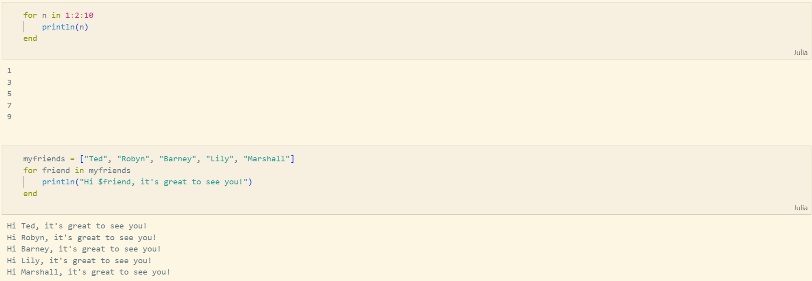
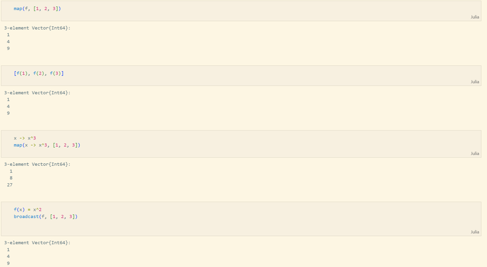
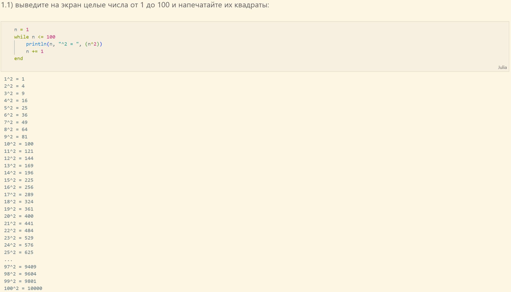
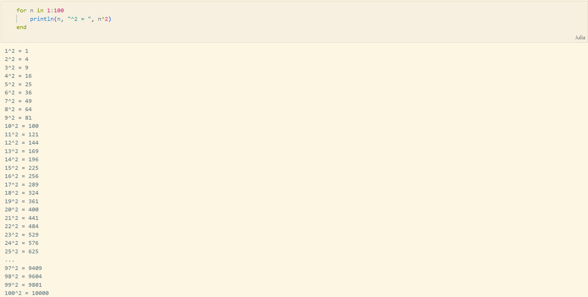
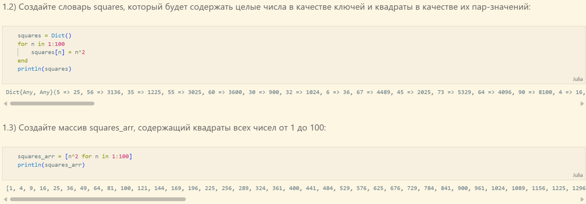
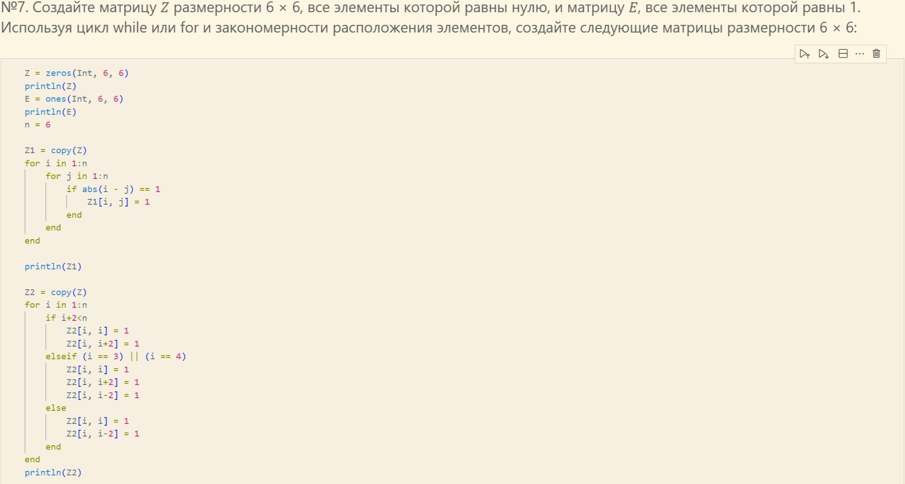
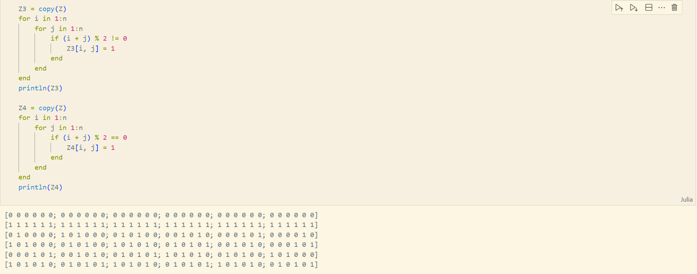
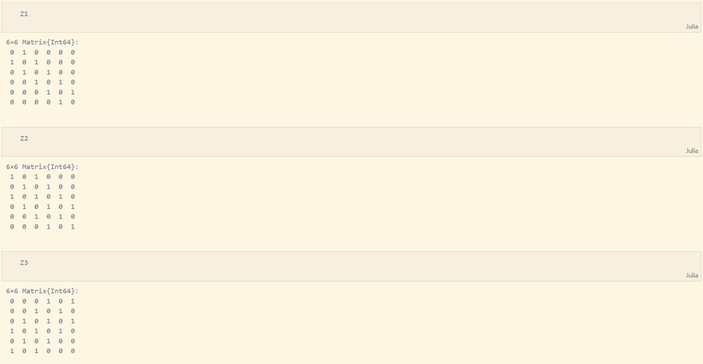
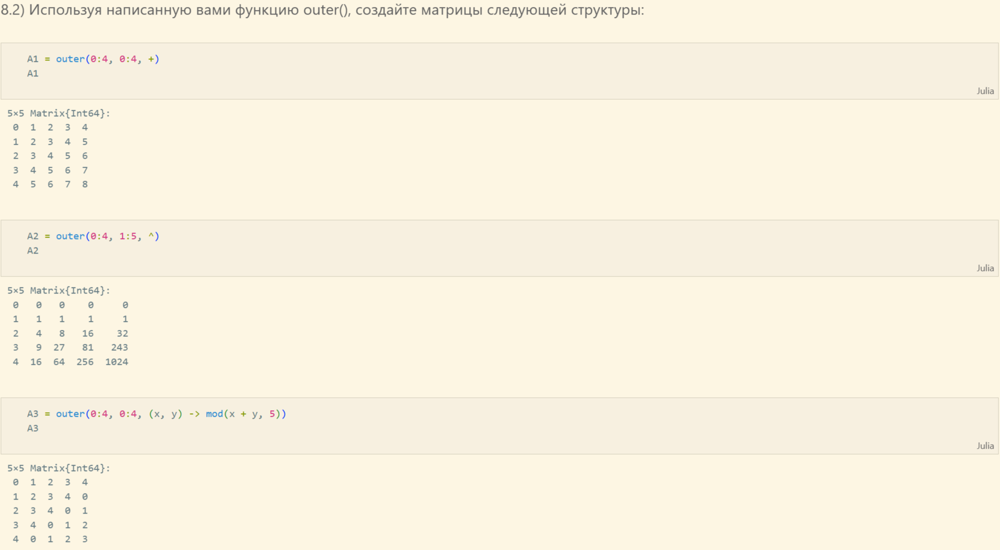
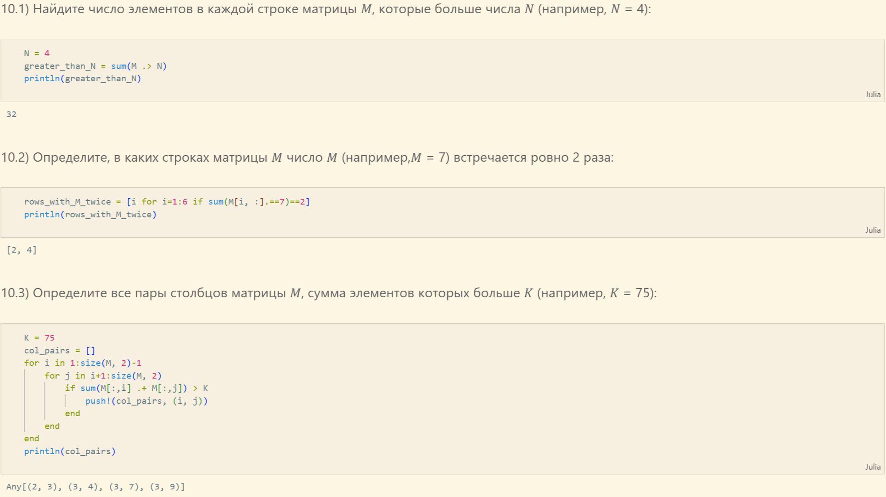

---
## Front matter
lang: ru-RU
title: Лабораторная работа №3
subtitle: "Управляющие структуры"
author:
  - Чемоданова Ангелина Александровна
teacher:
  - Кулябов Д. С.
  - д.ф.-м.н., профессор
  - профессор кафедры теории вероятностей и кибербезопасности 
institute:
  - Российский университет дружбы народов имени Патриса Лумумбы, Москва, Россия
date: 13 сентября 2025

## i18n babel
babel-lang: russian
babel-otherlangs: english

## Formatting pdf
toc: false
toc-title: Содержание
slide_level: 2
aspectratio: 169
section-titles: true
theme: metropolis
header-includes:
 - \metroset{progressbar=frametitle,sectionpage=progressbar,numbering=fraction}
---

## Докладчик

:::::::::::::: {.columns align=center}
::: {.column width="70%"}

  * Чемоданова Ангелина Александровна
  * Cтудентка НФИбд-02-22
  * Российский университет дружбы народов имени Патриса Лумумбы
  * [1132226443@pfur.ru](mailto:1132226443@pfur.ru)
  * <https://github.com/aachemodanova>

:::
::: {.column width="30%"}


:::
::::::::::::::

## Цели и задачи

**Цель работы**

Основная цель работы — освоить применение циклов функций и сторонних для Julia пакетов для решения задач линейной алгебры и работы с матрицами.

**Задание**

1. Используя Jupyter Lab, повторите примеры.
2. Выполните задания для самостоятельной работы.

##  Циклы while и for

Для различных операций, связанных с перебором индексируемых элементов структур данных, традиционно используются циклы while и for.

Синтаксис while

``` Julia
while <условие>
    <тело цикла>
end
```

##  Циклы while и for

{ #fig:001 width=100% height=100% }

##  Циклы while и for

Такие же результаты можно получить при использовании цикла for.

Синтаксис for

``` Julia
for <переменная> in <диапазон>
    <тело цикла>
end
```

##  Циклы while и for

{ #fig:002 width=100% height=100% }

##  Циклы while и for

{ #fig:003 width=90% height=90% }

##  Циклы while и for

{ #fig:004 width=100% height=100% }

## Условные выражения

Довольно часто при решении задач требуется проверить выполнение тех или иных условий. Для этого используют условные выражения.

Синтаксис условных выражений с ключевым словом:

``` Julia
if <условие 1>
    <действие 1>
elseif <условие 2>
    <действие 2>
else
    <действие 3>
end
```

## Условные выражения

{ #fig:005 width=100% height=100% }

## Функции 

{ #fig:006 width=100% height=100% }

## Функции

{ #fig:007 width=100% height=100% }

## Функции

По соглашению в Julia функции, сопровождаемые восклицательным знаком, изменяют свое содержимое, а функции без восклицательного знака не делают этого:

{ #fig:008 width=100% height=100% }

## Функции

В Julia функция map является функцией высшего порядка, которая принимает функцию в качестве одного из своих входных аргументов и применяет эту функцию к каждому элементу структуры данных, которая ей передаётся также в качестве аргумента.

Функция broadcast — ещё одна функция высшего порядка в Julia, представляющая собой обобщение 
функции map.Функция broadcast() будет пытаться привести все объекты
к общему измерению, map() будет напрямую применять данную функцию поэлементно.

## Функции

{ #fig:009 width=90% height=90% }

## Функции

{ #fig:010 width=80% height=80% }

## Функции

{ #fig:011 width=100% height=100% }

## Сторонние библиотеки (пакеты) в Julia

{ #fig:012 width=90% height=90% }

## Самостоятельная работа

{ #fig:013 width=80% height=80% }

## Самостоятельная работа

{ #fig:014 width=90% height=90% }

## Самостоятельная работа

{ #fig:015 width=100% height=100% }

## Самостоятельная работа

{ #fig:016 width=100% height=100% }

## Самостоятельная работа

{ #fig:017 width=100% height=100% }

## Самостоятельная работа

{ #fig:018 width=100% height=100% }

## Самостоятельная работа

{ #fig:019 width=100% height=100% }

## Самостоятельная работа

{ #fig:020 width=80% height=80% }

## Самостоятельная работа

{ #fig:021 width=80% height=80% }

## Самостоятельная работа

{ #fig:022 width=80% height=80% }

## Самостоятельная работа

{ #fig:023 width=80% height=80% }

## Самостоятельная работа

{ #fig:024 width=80% height=80% }

## Самостоятельная работа

{ #fig:025 width=100% height=100% }

## Самостоятельная работа

{ #fig:026 width=80% height=80% }

## Самостоятельная работа

{ #fig:027 width=80% height=80% }

## Самостоятельная работа

{ #fig:028 width=80% height=80% }

## Выводы

В результате выполнения данной лабораторной работы мы освоили применение циклов функций и сторонних для Julia пакетов для решения задач линейной алгебры и работы с матрицами.
