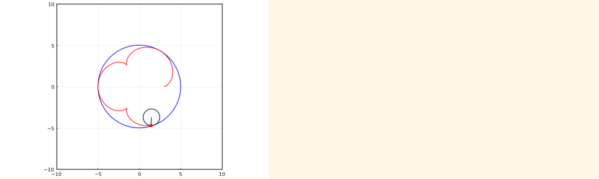

---
## Front matter
lang: ru-RU
title: Лабораторная работа №5
subtitle: "Построение графиков"
author:
  - Чемоданова Ангелина Александровна
teacher:
  - Кулябов Д. С.
  - д.ф.-м.н., профессор
  - профессор кафедры теории вероятностей и кибербезопасности 
institute:
  - Российский университет дружбы народов имени Патриса Лумумбы, Москва, Россия
date: 16 сентября 2025

## i18n babel
babel-lang: russian
babel-otherlangs: english

## Formatting pdf
toc: false
toc-title: Содержание
slide_level: 2
aspectratio: 169
section-titles: true
theme: metropolis
header-includes:
 - \metroset{progressbar=frametitle,sectionpage=progressbar,numbering=fraction}
---

## Докладчик

:::::::::::::: {.columns align=center}
::: {.column width="70%"}

  * Чемоданова Ангелина Александровна
  * Cтудентка НФИбд-02-22
  * Российский университет дружбы народов имени Патриса Лумумбы
  * [1132226443@pfur.ru](mailto:1132226443@pfur.ru)
  * <https://github.com/aachemodanova>

:::
::: {.column width="30%"}

:::
::::::::::::::

## Цели и задачи

**Цель работы**

Основная цель работы — освоить синтаксис языка Julia для построения графиков.

**Задание**

1. Используя Jupyter Lab, повторите примеры. При этом дополните графики обозначениями осей координат, легендой с названиями траекторий, названиями графиков и т.п.

2. Выполните задания для самостоятельной работы.

## Основные пакеты для работы с графиками в Julia

Рассмотрим построение графика функции f(x) = (3x2 + 6x − 9)e−0,3x разными способами:

{ #fig:001 width=70% height=70% }

## Основные пакеты для работы с графиками в Julia

{ #fig:002 width=100% height=100% }

## Основные пакеты для работы с графиками в Julia

{ #fig:003 width=100% height=100% }

## Основные пакеты для работы с графиками в Julia

{ #fig:004 width=80% height=80% }

## Основные пакеты для работы с графиками в Julia

{ #fig:005 width=100% height=100% }

## Опции при построении графика

На примере графика функции sin(x) и графика разложения этой функции в ряд Тейлора рассмотрим дополнительные возможности пакетов для работы с графикой:

## Опции при построении графика

{ #fig:006 width=80% height=80% }

## Опции при построении графика

{ #fig:007 width=80% height=80% }

## Опции при построении графика

{ #fig:008 width=100% height=100% }

## Опции при построении графика

Затем добавим различные опции для отображения на графике:

{ #fig:009 width=80% height=80% }

## Опции при построении графика

{ #fig:009 width=90% height=90% }

## Точечный график

Как и при построении обычного графика для точечного графика необходимо задать массив значений х, посчитать или задать значения у, задать опции построения графика:

{ #fig:011 width=70% height=70% }

## Точечный график

Для точечного графика можно задать различные опции, например размер маркера, его тип, цвет и и т.п.:

{ #fig:012 width=70% height=70% }

## Точечный график

{ #fig:013 width=80% height=80% }

## Аппроксимация данных

Аппроксимация — научный метод, состоящий в замене объектов их более простыми аналогами, сходными по своим свойствам.

Для демонстрации зададим искусственно некоторую функцию, в данном случае похожую по поведению на экспоненту:

## Аппроксимация данных

{ #fig:014 width=100% height=100% }

## Аппроксимация данных

Аппроксимируем полученную функцию полиномом 5-й степени:

{ #fig:015 width=80% height=80% }

## Пример траектории

{ #fig:016 width=100% height=100% }

## Полярные координаты

Приведём пример построения графика функции в полярных координатах:

{ #fig:017 width=80% height=80% }

## Параметрический график

Приведём пример построения графика параметрически заданной кривой на плоскости:

{ #fig:018 width=100% height=100% }

## Параметрический график

{ #fig:019 width=100% height=100% }

## График поверхности

Для построения поверхности, заданной уравнением f(x, y) = x2 + y2, можно воспользоваться функцией surface():

{ #fig:020 width=80% height=80% }

## График поверхности

{ #fig:021 width=100% height=100% }

## График поверхности

{ #fig:022 width=100% height=100% }

## График поверхности

{ #fig:023 width=100% height=100% }

## Линии уровня

Линией уровня некоторой функции от двух переменных называется множество точек на координатной плоскости, в которых функция принимает одинаковые значения. Линий уровня бесконечно много, и 
через каждую точку области определения можно провести линию уровня.

С помощью линий уровня можно определить наибольшее и наименьшее значение исходной функции от 
двух переменных. Каждая из этих линий соответствует определённому значению высоты. 

Поверхности уровня представляют собой непересекающиеся пространственные поверхности.

## Линии уровня

Рассмотрим поверхность, заданную функцией g(x, y) = (3x + y2)| sin(x) + cos(y)|:

{ #fig:024 width=90% height=90% }

## Линии уровня

Линии уровня можно построить, используя проекцию значений исходной функции на плоскость:

{ #fig:025 width=100% height=100% }

## Линии уровня

Можно дополнительно добавить заливку цветом:

{ #fig:026 width=100% height=100% }

## Векторные поля

Если каждой точке некоторой области пространства поставлен в соответствие вектор с началом в 
данной точке, то говорят, что в этой области задано векторное поле.

Векторные поля задают векторными функциями.

## Векторные поля

{ #fig:027 width=100% height=100% }

## Векторные поля

{ #fig:028 width=100% height=100% }

## Анимация

Технически анимированное изображение представляет собой несколько наложенных изображений (или построенных в разных точках графиках) в одном файле.

В Julia рекомендуется использовать gif-анимацию в pyplot().

## Анимация

{ #fig:029 width=100% height=100% }

## Анимация

{ #fig:030 width=100% height=100% }

## Гипоциклоида

Гипоциклоида — плоская кривая, образуемая точкой окружности, катящейся по внутренней стороне другой окружности без скольжения.

{ #fig:031 width=70% height=70% }

## Гипоциклоида

{ #fig:032 width=100% height=100% }

## Гипоциклоида

Для частичного построения гипоциклоиды будем менять параметр t:

{ #fig:033 width=100% height=100% }

## Гипоциклоида

Добавляем малую окружность гипоциклоиды:

{ #fig:034 width=100% height=100% }

## Гипоциклоида

Добавим радиус для малой окружности:

{ #fig:035 width=100% height=100% }

## Errorbars

В исследованиях часто требуется изобразить графики погрешностей измерения.

{ #fig:036 width=100% height=100% }

## Errorbars

{ #fig:037 width=100% height=100% }

## Errorbars

{ #fig:038 width=100% height=100% }

## Errorbars

{ #fig:039 width=100% height=100% }

## Errorbars

{ #fig:040 width=100% height=100% }

## Errorbars

{ #fig:041 width=80% height=80% }

## Errorbars

{ #fig:042 width=100% height=100% }

## Использование пакета Distributions

{ #fig:043 width=80% height=80% }

## Использование пакета Distributions

{ #fig:044 width=100% height=100% }

## Подграфики

Определим макет расположения графиков. Команда layout принимает кортеж layout = (N, M), который строит сетку графиков NxM. Например, если задать layout = (4,1) на графике четыре серии, то получим четыре ряда графиков:

{ #fig:045 width=70% height=70% }

## Подграфики

Для автоматического вычисления сетки необходимо передать layout целое число:

{ #fig:046 width=100% height=100% }

## Подграфики

Аргумент heights принимает в качестве входных данных массив с долями желаемых высот. Если в сумме дроби не составляют 1,0, то некоторые подзаголовки могут отображаться неправильно.

{ #fig:047 width=100% height=100% }

## Подграфики

Можно сгенерировать отдельные графики и объединить их в один, например, в сетке 2 × 2:

{ #fig:048 width=100% height=100% }

## Подграфики

{ #fig:049 width=100% height=100% }

## Подграфики

{ #fig:050 width=100% height=100% }

## Подграфики

{ #fig:051 width=100% height=100% }

## Самостоятельное выполнение

{ #fig:052 width=80% height=80% }

## Самостоятельное выполнение

{ #fig:053 width=100% height=100% }

## Самостоятельное выполнение

{ #fig:054 width=80% height=80% }

## Самостоятельное выполнение

{ #fig:055 width=80% height=80% }

## Самостоятельное выполнение

{ #fig:056 width=100% height=100% }

## Самостоятельное выполнение

{ #fig:057 width=100% height=100% }

## Самостоятельное выполнение

{ #fig:058 width=100% height=100% }

## Самостоятельное выполнение

{ #fig:059 width=100% height=100% }

## Самостоятельное выполнение

{ #fig:060 width=100% height=100% }

## Самостоятельное выполнение

{ #fig:061 width=80% height=80% }

## Самостоятельное выполнение

{ #fig:062 width=100% height=100% }

## Самостоятельное выполнение

{ #fig:063 width=100% height=100% }

## Самостоятельное выполнение

{ #fig:064 width=100% height=100% }

## Самостоятельное выполнение

{ #fig:065 width=100% height=100% }

## Самостоятельное выполнение

{ #fig:066 width=100% height=100% }

## Самостоятельное выполнение

{ #fig:067 width=100% height=100% }

## Самостоятельное выполнение

{ #fig:068 width=100% height=100% }

## Самостоятельное выполнение

{ #fig:069 width=100% height=100% }

## Самостоятельное выполнение

{ #fig:070 width=100% height=100% }

## Самостоятельное выполнение

{ #fig:071 width=100% height=100% }

## Самостоятельное выполнение

{ #fig:072 width=100% height=100% }

## Самостоятельное выполнение

{ #fig:073 width=100% height=100% }

## Выводы

В результате выполнения данной лабораторной работы мы освоили синтаксис языка Julia для построения графиков.
